#Analisis
1. tag script
```<HTML> 
  <HEAD><TITLE> contoh JavaScript</TITLE> 
  <script language="JavaScript"> 
  document.write("Program JavaSript Aku di kepala"); 
  </script> 
  </HEAD> 
  <BODY> 
  <script language="JavaScript"> 
  document.write("Program JavaSript Aku di body"); 
  </script> 
  </BODY> 
  </HTML>
  ```
  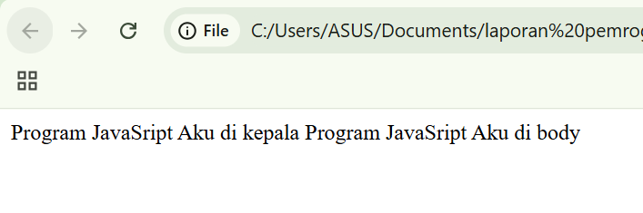
  1. Pada bagian <head>, terdapat sebuah script JavaScript dengan perintah document.write("Program JavaSript Aku di kepala");. Perintah ini akan langsung menuliskan teks "Program JavaSript Aku di kepala" ke halaman saat browser membaca bagian kepala dokumen.
  2. Pada bagian <body>, terdapat script lain dengan perintah document.write("Program JavaSript Aku di body");. Perintah ini juga menuliskan teks, yaitu "Program JavaSript Aku di body", saat browser membaca bagian isi halaman.

  2. event tertentu
    ```<html> 
    <head> 
    <title>Belajar Javascript : Mengenal Event Pada Javascript</title> 
    </head> 
    <body> 
    <h1>Mengenal Event Pada Javascript</h1> 
    <h2> Perograman WEB Event one click</h2> 
    <button onclick="tampilkan_nama()">klik disini </button> 
    <div id="hasil"></div> 
    <script>   
    function tampilkan_nama(){ 
    document.getElementById("hasil").innerHTML = 
    "<h3>Nama Saya Adalah Andi Akram Nur Risal</h3>"; 
    } 
    </script> 
    </body> 
    </html> 
    ```
    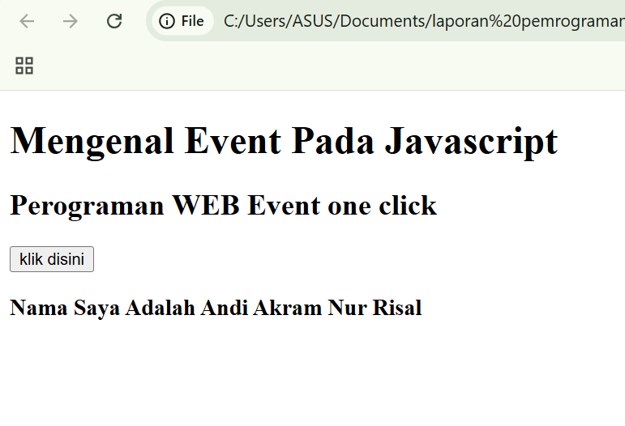
    <`h1`>Mengenal Event Pada Javascript<`/h1`> 
    👉 Menampilkan judul utama halaman dengan ukuran besar (heading 1).
    <`h2`> Perograman WEB Event one click<`/h2> 
    👉 Menampilkan sub-judul (heading 2) untuk menjelaskan topik.
    <button onclick="tampilkan_nama()">klik disini </button> 
    👉 Membuat tombol Saat tombol diklik, event onclick akan menjalankan fungsi JavaScript bernama tampilkan_nama().
    <div id="hasil"></div> 
    👉 Membuat sebuah elemen kosong dengan id="hasil".
      Elemen ini akan diisi dengan teks/dokumen HTML oleh JavaScript.
    <script>   
    👉 Menandakan awal dari kode JavaScript yang ditulis langsung di dalam file HTML.
    function tampilkan_nama()
    👉 Mendefinisikan sebuah fungsi dengan nama tampilkan_nama.
       Fungsi ini dipanggil saat tombol diklik.
       document.getElementById("hasil").innerHTML = 
    "<`h3>Nama Saya Adalah Andi Akram Nur Risal<`/h3"; 
    👉 Isi fungsi:document.getElementById("hasil") → mencari elemen HTML dengan id "hasil".
       dan <`h3> Nama Saya Adalah Andi Akram Nur Risal<`/h3`>.

3. contoh sederhana
  ```<HTML> 
    <HEAD><TITLE> contoh sederhana JavaScript</TITLE></HEAD> 
    <BODY> 
    <script language="JavaScript"> 
    document.write("Selamat Belajar Angkatan 2019","<br>"); 
    document.write("JavaScript Pemrograman WEB Teknik Komputer"); 
    </script> 
    </BODY> 
    </HTML>
    ```
    
    document.write("Selamat Belajar Angkatan 2019","<br>"); 
    👉 Perintah JavaScript untuk menulis langsung ke halaman web.
       document.write(...) → menampilkan teks ke dalam dokumen HTML.
       "Selamat Belajar Angkatan 2019" → teks yang ditampilkan.
       "<br>" → menambahkan baris baru (line break).

4. memasukkan data
```<HTML> 
    <HEAD> 
    <TITLE>Masukan Data</TITLE> 
    </HEAD> 
    <BODY> 
    <SCRIPT LANGUAGE = "JavaScript"> 
    <!-- 
       var nama = prompt("Siapa nama Anda?"); 
       document.write("Hai, " + nama); 
    //--> 
    </SCRIPT> 
    </BODY> 
    </HTML>
    ```
    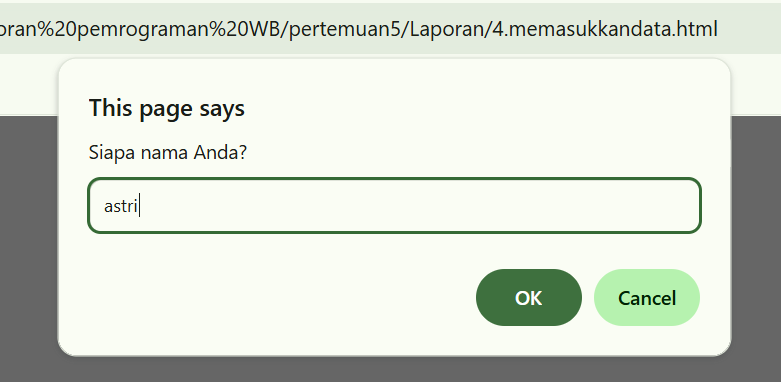
    <!-- 
       var nama = prompt("Siapa nama Anda?"); 
       document.write("Hai, " + nama); 
    //--> 
👉 Bagian isi script:
   var nama = prompt("Siapa nama Anda?");
   Membuat variabel bernama nama.
   prompt("Siapa nama Anda?") akan menampilkan kotak input (dialog prompt) di browser, tempat pengguna bisa mengetik nama.
   Nilai yang diketik pengguna akan disimpan ke variabel nama.
   document.write("Hai, " + nama);
   Menulis langsung ke halaman web. "Hai, " adalah string teks + nama menambahkan isi variabel nama ke teks. Jika pengguna mengetik Andi.

5. 1 jendela peringatan dan confirmasi
```<HTML> 
    <HEAD> 
    <TITLE>Alert Box</TITLE> 
    </HEAD> 
    <BODY> 
    <SCRIPT LANGUAGE = JavaScript > 
    window.alert("apakah anda akan meninggal halaman ini"); 
    </SCRIPT> 
    </BODY> 
    </HTML>
    ```
    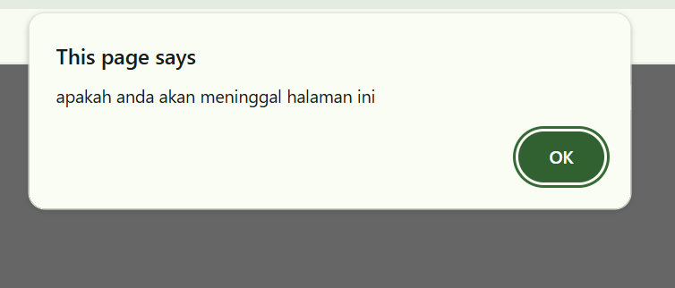
    window.alert("apakah anda akan meninggal halaman ini"); 
  👉 Baris utama kode JavaScript:
      window.alert(...) → memunculkan kotak dialog alert di browser.
      "apakah anda akan meninggal halaman ini" → teks pesan yang akan tampil di dalam alert box.
      Saat halaman dibuka, pengguna akan langsung melihat pesan ini dan harus menekan OK untuk melanjutkan.   

5.  2 jendela peringatan dan confirmasi
  ```<HTML> 
    <HEAD> 
    <TITLE>Konfirmasi</TITLE> 
    </HEAD> 
    <BODY> 
    <SCRIPT LANGUAGE = "JavaScript"> 
    <!-- 
       var jawaban = window.confirm( 
                     "Apakah anda sudah yakin ?"); 
       document.write("Jawaban Anda: " + jawaban); 
    //--> 
    </SCRIPT> 
    </BODY> 
    </HTML> 
    ```
    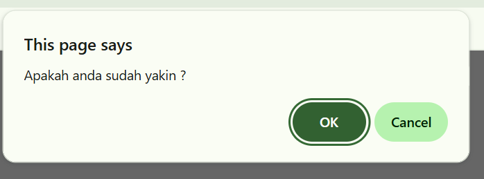
    <!-- 
       var jawaban = window.confirm( 
        "Apakah anda sudah yakin ?"); 
👉 Baris kode:
  window.confirm("Apakah anda sudah yakin ?");
  Membuka kotak dialog konfirmasi dengan pesan:
  Kotak konfirmasi punya dua tombol: OK dan Cancel.
  Jika pengguna klik OK → nilai yang dikembalikan adalah true.
  Jika pengguna klik Cancel → nilai yang dikembalikan adalah false.
  Nilai tersebut disimpan dalam variabel jawaban.

6. mendekasi variabel
```<HTML> 
    <HEAD> 
    <TITLE>Konfirmasi</TITLE> 
    </HEAD> 
    <BODY> 
    <SCRIPT LANGUAGE = "JavaScript"> 
    <!-- 
        var VariabelKu;  
        var VariabelKu2 = 3;  
        VariabelKu = 1234;  
        document.write(VariabelKu*VariabelKu2);  
    //--> 
    </SCRIPT> 
    </BODY> 
    </HTML>
    ```
    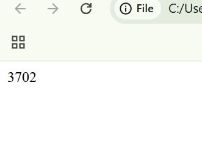
  👉var VariabelKu;  
    Mendeklarasikan variabel VariabelKu tanpa nilai awal (undefined).
  👉var VariabelKu2 = 3;  
    Mendeklarasikan variabel VariabelKu2 dengan nilai awal 3.
  👉VariabelKu = 1234;  
    Memberikan nilai 1234 ke variabel VariabelKu. 
  👉document.write(VariabelKu*VariabelKu2);  
    Mengalikan nilai VariabelKu × VariabelKu2 → 1234 × 3 = 3702
    Menampilkan hasil 3702 di halaman.  

7. global
```<html>
<head>
  <title>global</title>
</head>
<body>
  <script language="JavaScript">
    var a = 12;  
    var b = 4;  

    function Perkalian_Dengan2(b) {  
      a = b * 2; 
    }  
    document.write("Dua kali dari " + b + " adalah " + Perkalian_Dengan2(b) + "<br>");  
    document.write("Nilai dari a adalah " + a); 
  </script>
</body>
</html>
```
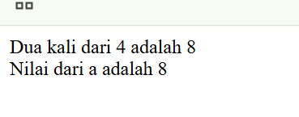
    var a = 12;  
    var b = 4;  
👉 Membuat dua variabel global:
    a = 12
    b = 4
    function Perkalian_Dengan2(b) {  
      a = b * 2; 
    }  
👉 Definisi fungsi Perkalian_Dengan2 dengan parameter b.
    Di dalam fungsi, nilai global a diubah menjadi hasil b * 2.
    Fungsi ini tidak memiliki return, jadi secara default mengembalikan undefined
  document.write("Dua kali dari " + b + " adalah " + Perkalian_Dengan2(b) + 
👉 Menulis teks ke halaman:
    "Dua kali dari " + b → mencetak angka 4.
    Perkalian_Dengan2(b) → memanggil fungsi dengan b = 4.
    Fungsi akan mengubah a = 8 (karena 4 * 2).
    Tapi karena tidak ada return, nilai yang dikembalikan adalah undefined.
document.write("Nilai dari a adalah " + a); 
👉 Menulis nilai variabel a setelah fungsi dipanggil.
 
8. konversi tipe data
```<html>
<head>
  <title>Konversi Bilangan</title>
</head>
<body>
  <script language="JavaScript">
    var a = parseInt(27);
    document.write("1. " + a + "<br>");
    a = parseInt(27.5);
    document.write("2. " + a + "<br>");
    a = parseInt("27A");
    document.write("3. " + a + "<br>");
    a = parseInt("A27.5");
    document.write("4. " + a + "<br>");
    var b = parseFloat(27);
    document.write("5. " + b + "<br>");
    b = parseFloat(27.5);
    document.write("6. " + b + "<br>");
    b = parseFloat("27A");
    document.write("7. " + b + "<br>");
    b = parseFloat("A27.5");
    document.write("8. " + b + "<br>");
  </script>
</body>
</html>
```
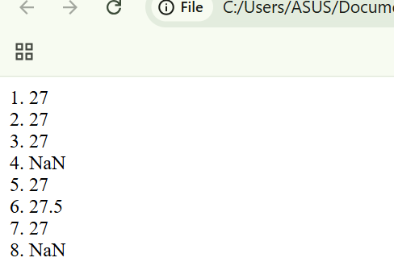
parseInt(27) → hasil 27 (bilangan bulat).
Output: 1. 27
parseInt(27.5) → hasil 27 (desimal dibuang).
Output: 2. 27
parseInt("27A") → membaca dari kiri, angka valid = 27, huruf A diabaikan.
Hasil 27.
Output: 3. 27
parseInt("A27.5") → diawali huruf, tidak ada angka valid di depan → hasil NaN (Not a Number).
Output: 4. NaN
parseFloat(27) → hasil 27 (bilangan bulat, tapi dalam tipe float).
Output: 5. 27
parseFloat(27.5) → hasil 27.5 (pecahan dipertahankan).
Output: 6. 27.5
parseFloat("27A") → membaca dari kiri, angka valid = 27, huruf A diabaikan.
Hasil 27.
Output: 7. 27
parseFloat("A27.5") → diawali huruf, tidak ada angka valid di depan → hasil NaN.
Output: 8. NaN

9. operator aritmatika
   ``` <HTML> 
    <HEAD> 
    <TITLE>Operasi Matematika</TITLE> 
    </HEAD> 
    <BODY> 
    <SCRIPT LANGUAGE = "JavaScript"> 
    <!-- 
    document.write("2 + 3 = " + (2 + 3) ); 
    document.write("<BR>"); 
    document.write("20 + 3 = " + (20 - 3) ); 
    document.write("<BR>"); 
    document.write("20* 3 = " + (2 * 3) ); 
    document.write("<BR>"); 
    document.write("40 / 3 = " + (40 / 3) ); 
    document.write("<BR>"); 
    //--> 
    </SCRIPT> 
    </BODY> 
    </HTML> 
    ```
    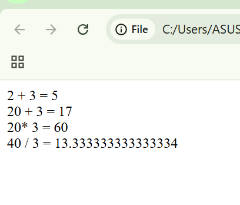
    document.write("2 + 3 = " + (2 + 3) ); 
    Operasi penjumlahan 2 + 3 = 5
    Output: 2 + 3 = 5
    document.write("20 + 3 = " + (20 - 3) ); 
    Sebenarnya teks ditulis 20 + 3, tapi operasi yang dipakai adalah 20 - 3 (pengurangan).
    Hasilnya = 17.
    document.write("20* 3 = " + (20* 3) ); 
    document.write("<BR>"); 
    Perkalian 20 * 3 → hasil 60.
    document.write("40 / 3 = " + (40 / 3) ); 
    document.write("<BR>"); 
    Pembagian 40 / 3 → hasil desimal 13.333333333333334 

    10. operator logika dan perbandingan
    ```<HTML> 
    <HEAD> 
    <TITLE>Operator ?</TITLE> 
    </HEAD> 
    <BODY> 
    <SCRIPT LANGUAGE = "JavaScript"> 
    <!-- 
    var nilai = prompt("Nilai (0-100): ", 0); 
    var hasil = (nilai >= 60) ? "Lulus" : "Tidak Lulus"; 
    document.write("Hasil: " + hasil); 
    //--> 
    </SCRIPT> 
    </BODY> 
    </HTML> 
    ```
    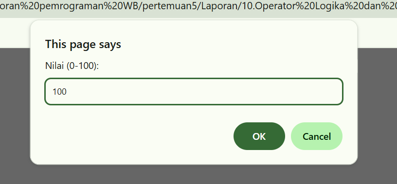
   👉var nilai = prompt("Nilai (0-100): ", 0); 
      prompt() → menampilkan kotak dialog input kepada pengguna.
      Pesan: "Nilai (0-100):
   👉var hasil = (nilai >= 60) ? "Lulus" : "Tidak Lulus"; 
      Ini menggunakan operator ternary ? :
      Sintaks: (kondisi) ? nilaiJikaTrue : nilaiJikaFalse
      nilai >= 60 → kondisi: apakah nilai ≥ 60
      Jika true → "Lulus"
      Jika false → "Tidak Lulus"
   👉document.write("Hasil: " + hasil); 
      Menampilkan hasil di halaman web.

11. tugas 1
```<HTML>
    <HEAD>
      <TITLE>Konversi Bilangan</TITLE>
    </HEAD>
    <BODY>
      <SCRIPT LANGUAGE="JavaScript">
      <!--
        var a = parseInt("45");
        document.write("1. " + a + "<BR>"); 
        a = parseInt("45.9");
        document.write("2. " + a + "<BR>");
    
        a = parseInt("45X");
        document.write("3. " + a + "<BR>");
    
        a = parseInt("X45.9");
        document.write("4. " + a + "<BR>");
    
        var b = parseFloat("45");
        document.write("5. " + b + "<BR>");
    
        b = parseFloat("45.9");
        document.write("6. " + b + "<BR>");
    
        b = parseFloat("45X");
        document.write("7. " + b + "<BR>");
    
        b = parseFloat("X45.9");
        document.write("8. " + b + "<BR>");
      //-->
      </SCRIPT>
    </BODY>
    </HTML>
    ```
    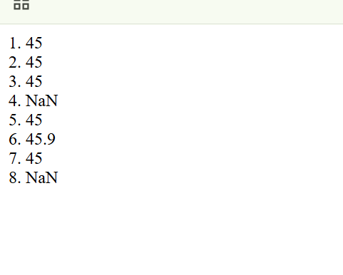
   👉 var a = parseInt("45");
      document.write("1. " + a + "<BR>");
      parseInt("45") → mengubah string "45" menjadi bilangan bulat 45.
      document.write() → menampilkan teks 1. 45 di halaman.
   👉a = parseInt("45.9");
     document.write("2. " + a + "<BR>");
     parseInt("45.9") → membaca angka di awal, bagian desimal .9 diabaikan → hasil 45.
     Output: 2. 45  
   👉 a = parseInt("45X");
      document.write("3. " + a + "<BR>");
      parseInt("45X") → membaca angka di awal, huruf X diabaikan → hasil 45.
      Output: 3. 45 
   👉ca = parseInt("X45.9");
     document.write("4. " + a + "<BR>");
     parseInt("X45.9") → string diawali huruf → tidak valid → hasil NaN.
     Output: 4. NaN
   👉var b = parseFloat("45");
     document.write("5. " + b + "<BR>");
     parseFloat("45") → mengubah string menjadi bilangan desimal → hasil 45.
     Output: 5. 45
   👉b = parseFloat("45.9");
      document.write("6. " + b + "<BR>");
      parseFloat("45.9") → string dikonversi menjadi float → hasil 45.9.
      Output: 6. 45.9
   👉b = parseFloat("45X");
      document.write("7. " + b + "<BR>");
      parseFloat("45X") → membaca angka di awal, huruf X diabaikan → hasil 45.
      Output: 7. 45
   👉b = parseFloat("X45.9");
      document.write("8. " + b + "<BR>");
      parseFloat("X45.9") → string diawali huruf → tidak valid → hasil NaN.
      Output: 8. NaN

12.  tugas 2
```<html>
<head>
  <title>Array</title>
</head>
<body>
  <h2>Menggunakan Tipe Data dalam Array</h2>

  <script language="JavaScript">
    var buah = ["Apel", "Jeruk", "Mangga", "Pisang", "Anggur"];

    document.write("<b>Daftar Buah:</b><br>");
    for (var i = 0; i < buah.length; i++) {
      document.write((i+1) + ". " + buah[i] + "<br>");
    }

    var angka = [1, 4, 5, 6, 8];

    document.write("<br><b>Isi Array Angka:</b><br>");
    for (var j = 0; j < angka.length; j++) {
      document.write("Index " + j + " = " + angka[j] + "<br>");
    }

    var total = 0;
    for (var k = 0; k < angka.length; k++) {
      total += angka[k];
    }
    document.write("<br><b>Jumlah Semua Angka = " + total + "</b>");
  </script>
</body>
</html>
```
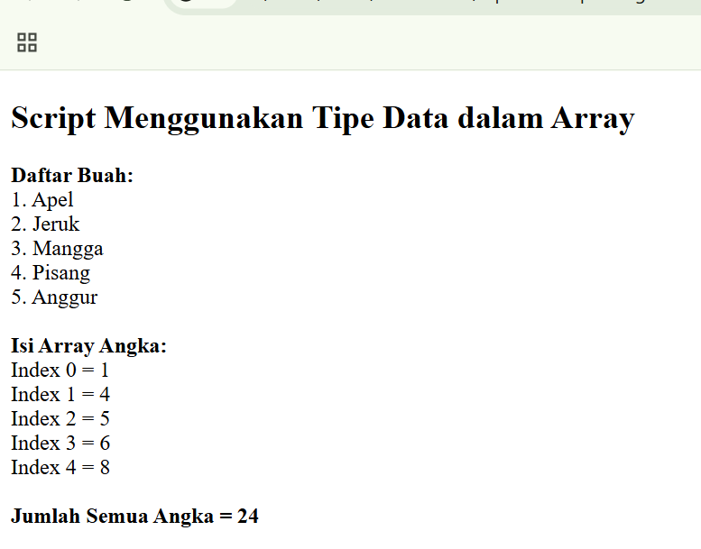
👉var buah = ["Apel", "Jeruk", "Mangga", "Pisang", "Anggur"];
   Membuat array bernama buah dengan elemen string.
   Array:["Apel", "Jeruk", "Mangga", "Pisang", "Anggur"]
👉document.write("<`b>Daftar Buah:</b`><br>");
   Menampilkan teks Daftar Buah: di halaman web dalam format tebal <b> dan baris baru <br>.
👉for (var i = 0; i < buah.length; i++) {
  document.write((i+1) + ". " + buah[i] + "<br>");
  }
  Loop for → menampilkan semua elemen array buah.
  i = 0 hingga i < buah.length (0 sampai 4).
  (i+1) → nomor urut mulai dari 1.
  buah[i] → mengambil elemen array ke-i.
👉var angka = [1, 4, 5, 6, 8];
  Membuat array bernama angka dengan elemen angka.
👉for (var j = 0; j < angka.length; j++) {
  document.write("Index " + j + " = " + angka[j] + "<br>");
  }
  Loop untuk menampilkan semua elemen array angka beserta indeksnya.
👉var total = 0;
  for (var k = 0; k < angka.length; k++) {
  total += angka[k];
  }
  Menghitung jumlah semua angka dalam array angka.
  total += angka[k] → menambahkan setiap elemen ke variabel total.
👉document.write("<`br><b`>Jumlah Semua Angka = " + total + "</b>");
  Menampilkan hasil penjumlahan total 24 di halaman web.
13. tugas 3
```<html lang="id">
<head>
  <meta charset="UTF-8">
  <meta name="viewport" content="width=device-width, initial-scale=1.0">
  <title>Kalkulator</title>
</head>
<body>
  <h2>Kalkulator</h2>

  Ke1: <input type="text" id="angka1"><br><br>
  Ke2: <input type="text" id="angka2"><br><br>

  <button onclick="tambah()">+</button>
  <button onclick="kurang()">-</button>
  <button onclick="kali()">*</button>
  <button onclick="bagi()">/</button>

  <h3>Hasil: <span id="hasil">0</span></h3>

  <script>
    function tambah() {
      let a = parseFloat(document.getElementById("angka1").value);
      let b = parseFloat(document.getElementById("angka2").value);
      document.getElementById("hasil").innerText = a + b;
    }
    function kurang() {
      let a = parseFloat(document.getElementById("angka1").value);
      let b = parseFloat(document.getElementById("angka2").value);
      document.getElementById("hasil").innerText = a - b;
    }
    function kali() {
      let a = parseFloat(document.getElementById("angka1").value);
      let b = parseFloat(document.getElementById("angka2").value);
      document.getElementById("hasil").innerText = a * b;
    }
    function bagi() {
      let a = parseFloat(document.getElementById("angka1").value);
      let b = parseFloat(document.getElementById("angka2").value);
      if (b === 0) {
        alert("Pembagian dengan nol tidak diperbolehkan!");
      } else {
        document.getElementById("hasil").innerText = a / b;
      }
    }
  </script>
</body>
</html>
```
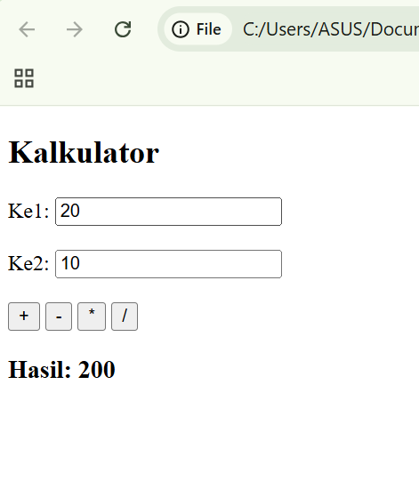
👉Ke1: <input type="text" id="angka1"><br><br>
  Ke2: <input type="text" id="angka2"><br><br>
  Dua input teks:
  id="angka1" → tempat memasukkan angka pertama.
  id="angka2" → tempat memasukkan angka kedua.
👉<button onclick="tambah()">+</button>
  <button onclick="kurang()">-</button>
  <button onclick="kali()">*</button>
  <button onclick="bagi()">/</button>
  Empat tombol operasi: tambah, kurang, kali, bagi.
  Setiap tombol memanggil fungsi JavaScript tertentu saat diklik:
👉<`h3>Hasil: <span id="hasil">0</span><`/h3>
  Menampilkan hasil perhitungan, Awalnya hasil bernilai 0.
👉let a = parseFloat(document.getElementById("angka1").value);
  parseFloat() → mengubah input teks menjadi angka desimal.
  Menuliskan hasil a + b ke dalam elemen <span id="hasil">.
👉function kurang() {
   let a = parseFloat(document.getElementById("angka1").value);
   let b = parseFloat(document.getElementById("angka2").value);
   document.getElementById("hasil").innerText = a - b;
   }
   Fungsi kurang(): melakukan pengurangan a - b.
👉function kali() {
   let a = parseFloat(document.getElementById("angka1").value);
   let b = parseFloat(document.getElementById("angka2").value);
   document.getElementById("hasil").innerText = a * b;
   }
   Fungsi kali(): melakukan perkalian a * b.
👉function bagi() {
   let a = parseFloat(document.getElementById("angka1").value);
   let b = parseFloat(document.getElementById("angka2").value);
   if (b === 0) {
   alert("Pembagian dengan nol tidak diperbolehkan!");
   } else {
   document.getElementById("hasil").innerText = a / b;
   } }
   Fungsi bagi():
   Jika b === 0, tampilkan pesan peringatan (alert) karena tidak bisa dibagi nol.Jika bukan nol, tampilkan hasil pembagian a / b.

14. tugas 4
```<html>
<head>
  <title>tugas4</title>
</head>
<body>
  <h2>Kalkulator bangun ruangku</h2>

  <h3>1. Volume Kubus</h3>
  Sisi: <input type="text" id="sisi">
  <button onclick="hitungKubus()">Hitung</button>
  <p>Hasil: <span id="hasilKubus"></span></p>

  <h3>2. Volume Balok</h3>
  Panjang: <input type="text" id="panjang"><br>
  Lebar: <input type="text" id="lebar"><br>
  Tinggi: <input type="text" id="tinggi"><br>
  <button onclick="hitungBalok()">Hitung</button>
  <p>Hasil: <span id="hasilBalok"></span></p>

  <h3>3. Volume Tabung</h3>
  Jari-jari: <input type="text" id="jari"><br>
  Tinggi: <input type="text" id="tinggiTabung"><br>
  <button onclick="hitungTabung()">Hitung</button>
  <p>Hasil: <span id="hasilTabung"></span></p>

  <script language="JavaScript">
    function hitungKubus() {
      var s = parseFloat(document.getElementById("sisi").value);
      var volume = s * s * s;
      document.getElementById("hasilKubus").innerHTML = volume;
    }

    function hitungBalok() {
      var p = parseFloat(document.getElementById("panjang").value);
      var l = parseFloat(document.getElementById("lebar").value);
      var t = parseFloat(document.getElementById("tinggi").value);
      var volume = p * l * t;
      document.getElementById("hasilBalok").innerHTML = volume;
    }

    function hitungTabung() {
      var r = parseFloat(document.getElementById("jari").value);
      var t = parseFloat(document.getElementById("tinggiTabung").value);
      var volume = 3.14 * r * r * t; 
      document.getElementById("hasilTabung").innerHTML = volume.toFixed(2);
    }
  </script>
</body>
</html>
```
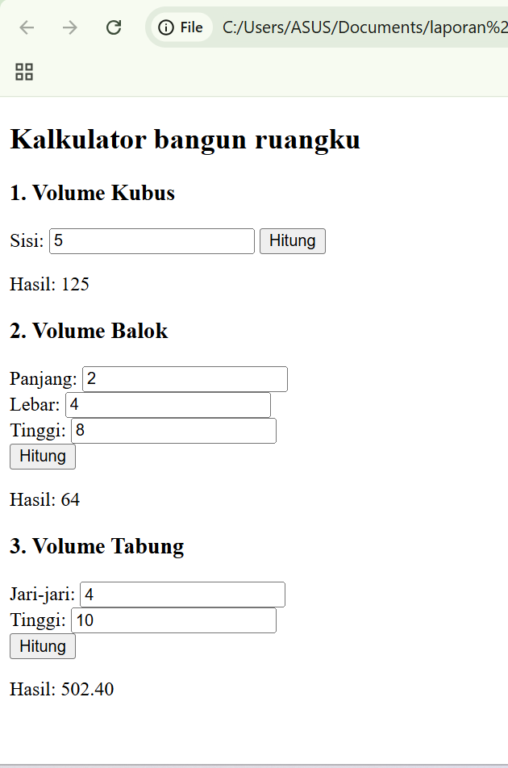
👉<`h3>1. Volume Kubus<`/h3>
  Sisi: <input type="text" id="sisi">
  <button onclick="hitungKubus()">Hitung</button>
  <'p'>Hasil: <span id="hasilKubus"></span><'/p'>
  <input> dengan id="sisi" → untuk memasukkan panjang sisi kubus.
  <button> memanggil fungsi hitungKubus() saat diklik.
  <span id="hasilKubus"> → menampilkan hasil volume kubus.
👉<`h3`>2. Volume Balok<`/h3`>
  Panjang: <input type="text" id="panjang"><br>
  Lebar: <input type="text" id="lebar"><br>
  Tinggi: <input type="text" id="tinggi"><br>
  <button onclick="hitungBalok()">Hitung</button>
  <`p>Hasil: <span id="hasilBalok"></span><`/p`>
  Tiga input: panjang, lebar, tinggi (id="panjang", "lebar", "tinggi").
  Tombol menghitung memanggil hitungBalok().
  <span id="hasilBalok"> menampilkan hasil volume balok.
👉<`h3>2. Volume Balok<`/h3`>
  Panjang: <input type="text" id="panjang"><br>
  Lebar: <input type="text" id="lebar"><br>
  Tinggi: <input type="text" id="tinggi"><br>
  <button onclick="hitungBalok()">Hitung</button>
  <'p>Hasil: <span id="hasilBalok"></span><`/p>
  Tiga input: panjang, lebar, tinggi (id="panjang", "lebar", "tinggi").
  Tombol menghitung memanggil hitungBalok().
  <span id="hasilBalok"> menampilkan hasil volume balok.
👉function hitungKubus() {
  var s = parseFloat(document.getElementById("sisi").value);
  var volume = s * s * s;
  document.getElementById("hasilKubus").innerHTML = volume;
  }
  Mengambil nilai sisi dari input, diubah menjadi angka desimal (parseFloat).
  Menghitung volume kubus: s³.
  Menampilkan hasil di <span id="hasilKubus">.
👉function hitungBalok() {
  var p = parseFloat(document.getElementById("panjang").value);
  var l = parseFloat(document.getElementById("lebar").value);
  var t = parseFloat(document.getElementById("tinggi").value);
  var volume = p * l * t;
  document.getElementById("hasilBalok").innerHTML = volume;
  }
  Mengambil nilai panjang, lebar, tinggi dari input.
  Menghitung volume balok: p × l × t.
  Menampilkan hasil di <span id="hasilBalok">.
👉function hitungTabung() {
  var r = parseFloat(document.getElementById("jari").value);
  var t = parseFloat(document.getElementById("tinggiTabung").value);
  var volume = 3.14 * r * r * t; 
  document.getElementById("hasilTabung").innerHTML = volume.toFixed(2);
  }
  Mengambil nilai jari-jari dan tinggi tabung.
  Menghitung volume tabung: π × r² × t (π ≈ 3.14).
  toFixed(2) → membatasi hasil menjadi 2 angka desimal.
  Hasil ditampilkan di <span id="hasilTabung">.


